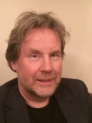

# BTAS-2018 - Special Session On Image And Video Forensics In Biometrics

The advancements in creating high-quality digitally manipulated content of the real world with detailed geometry, surface texture, and material in both static and dynamic environments has posed major problems in various domains. The introduction of highly realistic models such as Face2Face can not only fool the biometric systems but also have a large impact on the digital information channels. Another set of problems include the image manipulation attacks and video manipulation attacks which have proven to defeat the biometric systems.  The attack modes have made use of both traditional manipulation approaches and recent adversarial machine learning approaches (eg., GAN). Large-scale projects like DARPA MediFor SAVI and DARPA ODIN BATL have underlined the need to solutions to defend against these attack vectors.

In BTAS-2018, the special session on Image and Video Forensics in Biometrics is organized to evaluate the impact and mitigation measures of such adversarial attacks on biometrics systems. This half-day workshop in conjunction with BTAS-2018, calls for high-quality, previously unpublished works related to approaches and methodologies.

Papers are invited to report on following topics, but not limited to:
*	Novel attack mechanisms
*	Approaches on evaluating the human perception in detecting such attacks
*	Algorithmic advancements in detecting attacks
*	Detection and mitigation of adversarial attacks

# Topics (not limited to):

*	Image manipulation attacks in biometrics verification and identification (e.g., PAD).
*	Video manipulation attacks.
*	Forensic behavioral biometrics
*	Soft Biometrics cues for authenticity verification of biometric data
*	Multimedia forensics in biometrics
*	Integrity verification and authentication of digital content in biometrics.
*	Combination of multimodal decisions for authenticity verification in biometrics.
*	Human perception and decisions in biometric data authenticity verification
*	Ethical and societal implications of emerging manipulations
*	Case studies based on the aforementioned topics

# Important Dates

1. Workshop: **22nd October, 2018** (0900-1230)
2. Full Paper Submission: ~~Aug 22nd, 2018~~ (Completed)
3. Acceptance Notification: ~~Sep 10th, 2018~~ (Completed)
4. Camera-Ready Paper Due: ~~Sep 20th 2018~~ (Completed)

# Program

  

# Keynote Speakers
1.  **Prof. Adams Wai Kin Kong** - received the Ph.D. degree from the University of Waterloo, Canada. Currently, he is an associate professor at the Nanyang Technological University, Singapore. His papers have been published in leading journals and conferences in his research areas. One of his papers was selected as a spotlight paper by TPAMI and another was selected as Honorable Mention by Pattern Recognition. With his students, he received best student paper awards in The IEEE Fifth International Conference on Biometrics: Theory, Applications and Systems (BTAS), 2012 and IEEE International Conference on Bioinformatics and Bioengineering, 2013. Dr. Kong received a number of awards from Singapore government for his cooperation with Singapore Police Force and the best reviewer award in BTAS 2016. In the summer of 2008, he served as an expert witness to the U.S. Department of Justice for a case of child sexual abuse. Currently, he is serving as an associate editor for IEEE Transactions on Information Forensics and Security. He has developed ten patents. His research interests include pattern recognition, image processing, biometrics, and forensics.

2.  **Prof. Didier Meuwly** is born in Fribourg, Switzerland. After a classical education (Latin / Philosophy), he graduated as a criminalist and criminologist in 1993 and received his PhD in 2000 at the School for Forensic Science of the University of Lausanne, Switzerland. He currently shares his time between the Forensic Institute of the Dutch Ministry of Security and Justice (Netherlands Forensic Institute – NFI), where he is a principal scientist, and the University of Twente (UT), where he holds the chair of Forensic Biometrics from 2013 onwards. He specializes in the automation and validation of the probabilistic evaluation of forensic evidence, and more specifically from biometric traces. He is also interested in the contribution of biometrics for identity management. From 2002 to 2004 he worked as a senior forensic scientist at the R & D department of the UK Forensic Science Service (FSS), then an executive agency of the British Home Office. Didier has served as a criminalist in several international terrorist cases on request of the ICTY, STL, UN and UK. He has authored and coauthored more than 60 scientific publications and book chapters in the field of forensic science and is currently the lead editor of 2 draft ISO standards (21043-3 and 22842-1). He is a member of the editorial board and guest editor of Forensic Science International (FSI), member of the editorial board of IET Biometrics and a member of the R&D Standing Committee (RDSC) of the European Network of Forensic Science Institutes (ENFSI).

# Instructions for Presentations

If a paper is not presented (oral or poster) by one of its authors, then the paper will be withdrawn from the proceedings. There will be NO exceptions to this policy. Authors may not delegate the presentation of their paper to anyone else.

Each paper will be given a 12-minute oral + poster presentation.

## Short Oral Presentation

During the Short Oral Presentation, speakers will highlight the key ideas in their paper in 10 minutes. The authors are allowed to display the posters, where in-depth conversation can take place during the coffee and lunch break.

## Poster Presentation

All posters can be mounted after 08:30 am and 3:00 pm on the day of the presentation. Mounting boards and pins/adhesives will be available in the poster room. Posters must be removed from their mounting at the end of the day of the special session.

Each poster board will be of size 8 feet horizontal, and 4 feet vertical.

# Oragnizing Committee

| | ||
|:---:|:---:|:---:|
| **Prof. Raymond Veldhuis** | **Assoc. Prof. Kiran Raja** | **Assit. Prof. Chris Zeinstra** |
| UTW, Netherlands | University of South-Eastern Norway | UTW, Netherlands |
| [e-mail](r.n.j.veldhuis@utwente.nl) | [e-mail](kiran.raja@usn.no) | [e-mail](c.g.zeinstra@utwente.nl) |

# Further Information
[CMT Submission Site](https://cmt3.research.microsoft.com/BTASSS2018/)

[BTAS2018 Official Site](https://www.isi.edu/events/btas2018/home)

# Submission Guidelines
 
Submissions should conform to the BTAS 2018 proceedings style. Accepted papers from the Special Session will be included in the BTAS Proceedings through IEEE. Papers must be submitted online through the submission system [CMT Submission Site](https://cmt3.research.microsoft.com/BTASSS2018/) and will be double-blind peer reviewed by at least three reviewers.

## Paper Submission Guidelines
 
1. The submitted paper should not be under review in other conferences, workshops, journals. Submitted papers may be checked with a plagiarism detection tool. Simultaneous submission to arxiv is allowed.
 
2. Submissions may be up to eight pages in IEEE conference format, excluding references. There is no limit on bibliography pages. Note that papers longer than six pages in the published proceedings will incur a page charge, up to two extra pages (bibliography pages will not incur an extra charge).
 
3. Authors can submit one supplementary file. The size should not exceed 100 MB (maximum allowable by CMT) and can be in doc, pdf or zip format.
 
4. Papers accepted at the conference must be presented by one of the authors, and at least one of the authors must register before the paper registration deadline. Each author registration applies towards only one paper. If an accepted paper is not registered and/or not presented at the conference, it will be withdrawn from the proceedings and from IEEE Xplore. BTAS 2018 reserves the right to exclude a paper from publication if the paper is not presented (no-show) at the conference.
 
5. Authors may not delegate presentation of their paper to a non-author in attendance.

6. Authors are required by IEEE to transfer copyrights for any papers placed in Xplore. This is performed at the time final versions are submitted for production. If a paper is withdrawn from the proceedings, copyright will revert to the authors.
 LaTeX and Microsoft Word templates can be found at:
   * [Word Template](https://filesender.uninett.no/download.php?token=74232a7c-255d-40c7-8b83-52fd598271bd&files_ids=109965)
   * [Latex Template](https://filesender.uninett.no/download.php?token=555df014-1972-47df-9fd5-25a630d119a8&files_ids=109962)

7. The review process is double-blind. Please remove author names, affiliations, email addresses, etc. from the paper. Please remove personal acknowledgments.
 
8. When reporting experiments on data collected in your lab, consider stating this as “This experiment was conducted using data acquired in our labs”. Do not state this as “This experiment was conducted using data that was collected in our labs at Mars University”
 When citing your own work, ensure that the narrative does not divulge your identity.
 
9. Please submit your paper to the Microsoft Conference Management Toolkit at: [https://cmt3.research.microsoft.com/BTASSS2018/](https://cmt3.research.microsoft.com/BTASSS2018/)

Detailed instructions can be found at: [https://www.isi.edu/events/btas2018/paper_submission_guidelines](https://www.isi.edu/events/btas2018/paper_submission_guidelines)

